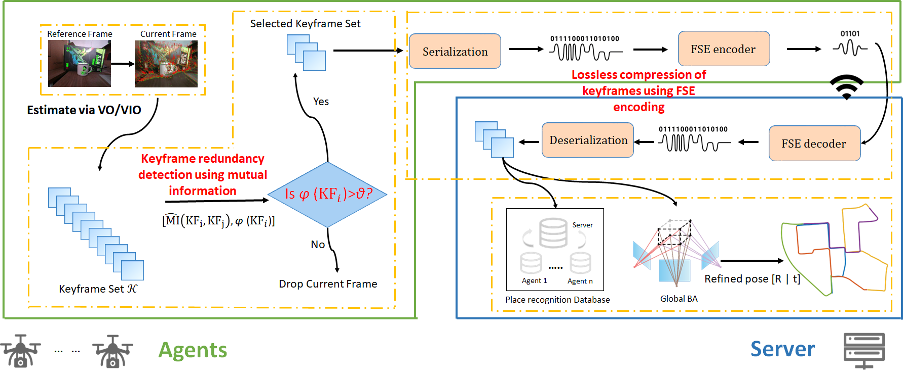

# Bandwidth-Efficient Collaborative SLAM: Mutual Information for Data Selection and Finite-State Entropy for Lossless Compression
## Introduction

This repository contains an implementation of our **bandwidth-optimized collaborative multi-robot SLAM method**, **integrated into the [COVINS](https://github.com/VIS4ROB/COVINS)** framework. In scenarios where **resource-constrained robots** collaborate with a **central server**, limited communication bandwidth often becomes a **critical bottleneck** for real-time mapping and localization.

To address this challenge, we propose a **mutual-information-based keyframe selection strategy** that transmits only the **most informative** visual keyframes, **significantly reducing redundant data**. Furthermore, we apply **finite-state entropy coding** for **lossless compression**, further minimizing transmission costs.

Since this work is **integrated into COVINS**, it can be **easily adopted** by users familiar with COVINS and **seamlessly incorporated into existing SLAM pipelines**, enabling **better scalability** and **reduced wireless communication load** in practical deployments.

